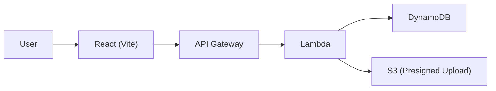

# kus-aws-frontend

Vite(React/TS) + Express(WS) + Drizzle 기반의 프런트엔드 애플리케이션(풀스택 개발 모드 포함)입니다.
프런트는 `client/`, 서버 런타임은 `server/`, 공용 타입/스키마는 `shared/`에 위치합니다.

## 서비스 개요
- **무엇**: 개발자/비개발자 모두를 위한 AI Q&A Web App의 프런트엔드.
- **왜**: 팀 내 축적된 지식/문서/파일을 빠르게 검색·대화형으로 활용하기 위함.
- **어떻게**: API Gateway → Lambda → DynamoDB(+S3) 백엔드와 통신하여, 세션·메시지·업로드를 처리하고 UI는 React + Tailwind로 경량 제공.

### 주요 기능
- **대화 세션 관리**: 세션 생성/제목 수정, 최신순 목록 조회
- **메시지 타임라인**: `/sessions/{sessionId}/messages` 스트림 조회 및 전송
- **파일 업로드**: S3 Presigned URL 기반 업로드(대용량 지원)
- **검색/템플릿**: 카테고리/템플릿 기반 프롬프트 가이드(예: `client/src/pages` 및 `components/*`)
- **접근성/테마**: 다크모드, 키보드 내비게이션, 폰트 사이즈 패널 등

### 사용자 흐름(요약)
1) 사용자가 홈에서 카테고리/템플릿 선택 또는 자유 입력으로 질문
2) 백엔드 API 호출로 세션 생성/메시지 저장
3) UI는 실시간 타임라인을 렌더링하고, 필요 시 파일을 S3로 업로드(사전 presign)
4) 과거 세션은 최신순으로 탐색하고 재개

### 아키텍처(프런트 관점)


### 보안/운영 메모
- 프런트 빌드 산출물은 Amplify Hosting에 **수동 업로드**로 배포
- API 베이스 URL은 환경변수 `VITE_API_BASE_URL`로 주입
- CORS는 백엔드(API Gateway/Lambda)에서 Amplify 도메인만 허용하도록 제한 권장
- 개인 키/시크릿은 코드/프런트 번들에 포함 금지

### 로드맵(예시)
- 채팅 답변 스트리밍(서버센트 이벤트/웹소켓) UI
- 세션 공유/태깅, 즐겨찾기, 검색 하이라이트
- 접근성 레벨 업(ARIA), 성능 측정(LCP/INP), 번역 i18n

## Requirements
- Node.js ≥ 18 (LTS 권장)
- npm ≥ 9
- (선택) PostgreSQL/Neon 등 연결 시 `DATABASE_URL`

## Scripts
- `npm run dev`: 개발 서버(Express + Vite 미들웨어) 실행
- `npm run dev:client`: 프런트만 Vite 개발 서버 실행 (root=`client/`)
- `npm run dev:server`: 서버만 개발 모드(tsx) 실행
- `npm run build`: 전체 빌드 (클라이언트 → `dist/public`, 서버 → `dist/index.js`)
- `npm run build:client`: 프런트만 빌드 (`client/dist`)
- `npm start`: 프로덕션 서버 실행(`node dist/index.js`)
- `npm run check`: 타입 체크
- `npm run db:push`: Drizzle 마이그레이션 푸시

## Quick Start (로컬)
1) 의존성 설치
```
npm i
```

2) (선택) 환경 변수 설정
- 프런트(`client/.env`):  
  ```
  VITE_API_BASE_URL=http://localhost:8000
  ```
  - Amplify Hosting 사용 시 API Gateway Invoke URL로 교체
- 서버(`.env`, 선택):  
  ```
  PORT=3000
  DATABASE_URL=postgres://...
  NODE_ENV=development
  SESSION_SECRET=replace-with-strong-secret
  ```
  - 실제 필요한 변수는 구현에 따라 다를 수 있습니다. DB/세션을 쓰지 않으면 생략 가능

3) 개발 실행 (풀스택)
```
npm run dev
```
- 또는 프런트만: `npm run dev:client`  
- 또는 서버만: `npm run dev:server`

## Build & Deploy
- 전체 빌드
```
npm run build
# 결과물: dist/public (정적 파일), dist/index.js (서버), client/dist (클라이언트 단독 배포용)
```

- 프로덕션 실행
```
npm start
```

### Amplify Hosting(수동 업로드) 가이드

1) Vite 환경변수 설정 (API 베이스)

- `client/` 아래 환경 파일 생성
```
client/.env.local
VITE_API_BASE_URL=http://localhost:8000

client/.env.production
VITE_API_BASE_URL=https://{api-id}.execute-api.{region}.amazonaws.com
# 스테이지가 prod인 경우, 끝에 "/prod"를 붙이세요 (마지막 슬래시 없이)
# 예) https://xxxx.execute-api.us-east-1.amazonaws.com/prod
```
- 주의: 이 파일들은 커밋하지 않습니다(`.gitignore`에 `.env*` 포함).
- 끝에 슬래시는 붙이지 않습니다.

2) 빌드 실행(루트에서)
```
npm i
npm run build
# 산출물: dist/public, dist/index.js, client/dist
```

3) Amplify Hosting 수동 업로드
- Amplify 콘솔 → Hosting → Deploy without Git → Drag & drop
- 폴더 `client/dist` 를 업로드 대상로 지정
- SPA 라우팅이 필요하면 커스텀 리라이트/헤더 추가:
  - SPA rewrite: `/* → /index.html (200)`
  - 배포 후 `/health` 페이지에서 상태 확인

4) 배포 검증 및 CORS 확인
- API Gateway/Lambda 응답에서 Amplify 도메인을 허용 Origin 으로 설정
 - 배포 후 브라우저 네트워크 탭으로 `/health` 요청이 200인지 확인
 - 주의: Vite는 빌드 타임 치환을 사용하므로 API URL 변경 시 반드시 재빌드 필요

5) 트러블슈팅
- 새로고침 403/404: 위 SPA rewrite 규칙 적용
- CORS 에러: `VITE_API_BASE_URL`과 백엔드 CORS 설정 재확인
- 프런트는 설정된 베이스 아래 `/api/*` 경로로 호출

### Quick Deploy Checklist
- `client/.env.production` 설정:
  - 스테이지 없음: `VITE_API_BASE_URL=https://{api-id}.execute-api.{region}.amazonaws.com`
  - 스테이지 prod: `...amazonaws.com/prod` (끝에 슬래시 없이)
- `npm run build` 실행 → 업로드 대상: `client/dist`
- Amplify Hosting 콘솔 업로드(Drag & Drop)
- SPA rewrite 규칙 추가: `/* → /index.html (200)`
- 배포 URL에서 `/health` 페이지로 200 응답 확인
- 필요 시 CORS에 Amplify 도메인 Origin 허용

## 디렉토리 구조
```
kus-aws-frontend/
├─ client/                 # Vite(React/TS) 클라이언트
│  ├─ index.html
│  ├─ src/
│  │  ├─ App.tsx
│  │  ├─ components/...
│  │  ├─ pages/...
│  │  ├─ services/api.ts
│  │  ├─ hooks/, lib/, stores/ ...
│  │  └─ index.css, main.tsx
│  ├─ vite.config.ts       # root=client 로 동작
│  └─ package.json         # (개발 스크립트는 상위에서 실행)
├─ server/                 # Express/WS 서버
│  ├─ index.ts
│  ├─ routes.ts
│  ├─ vite.ts              # Vite 미들웨어 연동
│  └─ db.ts, storage.ts    # DB/스토리지 연동(선택)
├─ shared/                 # 공용 스키마/타입
│  └─ schema.ts
├─ dist/                   # 빌드 산출물(서버 ESM 번들 + public 정적파일)
│  └─ public/
├─ drizzle.config.ts       # Drizzle 설정
├─ vite.config.ts          # 상위 vite 설정(root=client, alias 설정 포함)
├─ tsconfig.json
└─ package.json
```

## 경로 별칭 (Vite)
`vite.config.ts`에 다음 alias가 설정되어 있습니다.
- `@` → `client/src`
- `@shared` → `shared`
- `@assets` → `attached_assets` (존재 시)

사용 예:
```ts
import { something } from "@/lib/utils"
import { schema } from "@shared/schema"
```

## API 연동
- 프런트 기본 베이스 URL은 `VITE_API_BASE_URL` 환경변수로 주입
- 해커톤 권장 백엔드: API Gateway → Lambda
  - 프런트 `.env`:
    ```
    VITE_API_BASE_URL=https://<api-id>.execute-api.us-east-1.amazonaws.com/prod
    ```

## 데이터/DB (선택)
- Drizzle 사용 시 `DATABASE_URL` 설정 후
```
npm run db:push
```
- Neon 등 서버리스 Postgres를 사용할 수 있습니다. 사용하지 않는다면 DB 관련 설정은 생략 가능합니다.

## 스타일/빌드
- Tailwind CSS 및 PostCSS 설정 포함
- 빌드시 클라이언트는 `dist/public`, 서버는 `dist/index.js`로 번들됩니다.

## AWS 메모
- 리전: us-east-1
- Access Key 발급 금지, 역할(Role) 사용
- Amplify Hosting(수동 업로드): `npm run build:client` 후 `client/dist` 업로드
- S3 버킷 네이밍: username 접두 필수 (예: `username-frontend-assets`)

## 트러블슈팅
- 포트 충돌 시:
  - 서버 `PORT` 변경 또는 프런트 Vite 개발 서버 포트 지정
- API CORS:
  - 백엔드(또는 API Gateway)에서 Origin을 Amplify 도메인으로 허용

## 현재 진행 상태 (woo)
- **API 베이스 일원화**: `VITE_API_BASE_URL`로 통합, 기본값 `http://localhost:8000`
- **환경파일/보안**: `.gitignore`에 `.env*`, `client/.env*` 추가; 로컬/프로덕션 예시 제공
- **API 서비스 점검**: `client/src/services/api.ts`가 `import.meta.env.VITE_API_BASE_URL` 사용
- **헬스체크 UI 추가**: `/health` 라우트에서 `/api/health` 호출 테스트 가능
- **배포 가이드 통합**: Amplify 수동 업로드 가이드 `README.md`로 병합 (`README_DEPLOY.md` 제거)
- **빌드 스크립트 보강**: 권한 이슈 회피를 위해 Vite/esbuild를 node로 호출; `client/dist` 산출

### 남은 태스크
- **VITE_API_BASE_URL 확정**: 실제 API Gateway Invoke URL로 `client/.env.production` 업데이트
- **Amplify 수동 배포**: `client/dist` 업로드 및 SPA 리라이트 규칙(`/* 200`) 설정
- **CORS 검증**: API Gateway/Lambda에서 Amplify 도메인 Origin 허용 확인
- **헬스체크 검증**: 개발/프로덕션 환경에서 `/health` 응답 확인
- **선택: API 호출 통합**: ad-hoc `fetch` 호출을 점진적으로 `apiService` 기반으로 통합
- **선택: CI/품질**: 빌드/린트/타입체크 워크플로 도입, `ApiService` 단위 테스트 추가

